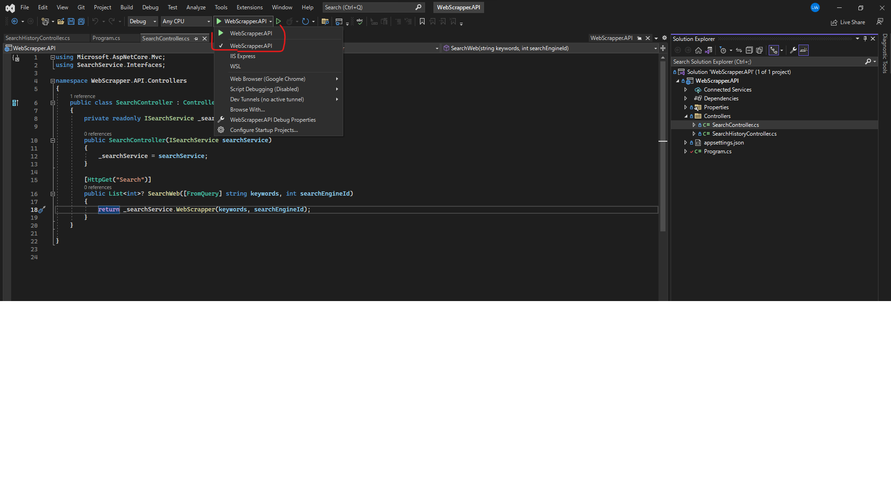

# WebScraper-for-InfoTrack

---

## Purpose Of The App

The CEO from InfoTrack is very interested in SEO and how this can improve Sales. Every morning he
searches the keyword “land registry searches” in Google and counts down to see where and how many
times their company, www.infotrack.co.uk sits on the list. Seeing the CEO do this every day, a smart
software developer at InfoTrack decides to write a small application for him that will automatically perform
this operation and return the result to the screen. They design and code some software that receives a
string of keywords, and a string URL. This is then processed to return a string of numbers for where the
resulting URL is found in Google. For example “1, 10, 33” or “0”. The CEO is only interested if their URL
appears in the first 100 results.

## Usage/Instructions

### 1. Database(Microsoft SQL Server Management Studio)

- Run the below SQL Query to create the DB Schema and insert the initial Data:
  CREATE TABLE [dbo].[SearchEngine] (
  [Id] INT IDENTITY(1,1) NOT NULL,
  [BaseUrl] NVARCHAR(MAX) NOT NULL,
  [HeaderValue] NVARCHAR(MAX) NULL,
  [Name] NVARCHAR(MAX) NOT NULL,
  [RegexPattern] NVARCHAR(MAX) NULL,
  PRIMARY KEY ([Id])
  );

CREATE TABLE [dbo].[SearchHistories] (
[Id] INT NOT NULL IDENTITY,
[Keywords] NVARCHAR(MAX) NOT NULL,
[SearchEngineId] INT NOT NULL,
[Ranking] NVARCHAR(MAX) NOT NULL,
[SearchDate] DATETIME2 NOT NULL,
CONSTRAINT [PK_SearchHistories] PRIMARY KEY ([Id])
);

INSERT INTO SearchEngine (Name, BaseUrl,RegexPattern, Headervalue)
VALUES ('Google', 'https://www.google.co.uk/search?num=100&q=', '/url?q=(.\*?)&sa=U&ved=','CONSENT=YES+42');

### 2. API(WebScrapper.API)

- cd to the WebScrapper.API folder andopen up the 'WebScrapper.API.sln'
- Run the solution by clicking 'WebScrapper.API'
  

### 3. Client(Angular)

- cd to WebScrapper.App/webscrapper-app folder.
- run `npm install` to install all necessary dependencies.
- `npm start` to start the Angular client
## API

### Available routes

- /api/Search/?query
- /api/History

### Query Example

?keywords=infotrack&searchEngineId=1

## Status

Completed

## Future Feature

- Trends / history of where InfoTrack ranked on a daily / weekly basis
