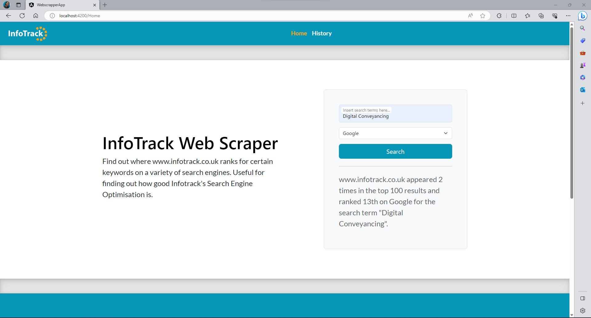

# WebScraper-for-InfoTrack

---

## Purpose Of The App

The CEO from InfoTrack is very interested in SEO and how this can improve Sales. Every morning he
searches the keyword “land registry searches” in Google and counts down to see where and how many
times their company, www.infotrack.co.uk sits on the list. Seeing the CEO do this every day, a smart
software developer at InfoTrack decides to write a small application for him that will automatically perform
this operation and return the result to the screen. They design and code some software that receives a
string of keywords, and a string URL. This is then processed to return a string of numbers for where the
resulting URL is found in Google. For example “1, 10, 33” or “0”. The CEO is only interested if their URL
appears in the first 100 results.

## Screenshots

## Dependencies

Download and install the following:

- Angular 16
- Visual Studio
- Microsoft SQL Server Management Studio

## Usage/Instructions

### 1. Database(Using Microsoft SQL Server Management Studio)

- Open up the SearchHistory solution in Visual Studio and open the "Package Manager Console".
- Run the command "update-database"
- Open up the Search solution in Visual Studio and open the "Package Manager Console".
- Run the command "update-database".
  
- Opem up Micrisoft SQL Server Mangement studio and run the below query:

INSERT INTO SearchEngine (Name, BaseUrl,RegexPattern, Headervalue) VALUES ('Google', 'https://www.google.co.uk/search?num=100&q=', '/url?q=(.\*?)&sa=U&ved=','CONSENT=YES+42');

INSERT INTO SearchEngine (Name, BaseUrl,RegexPattern, Headervalue) VALUES ('Bing', 'https://www.bing.com/search?count=100&q=', 'class="tilk" href="(.\*?)"',null);

Note - Connection strings can be found in the ...Context.cs files of the search and searchhistory solutions

### 2. API(Using Visual Studio)

- cd to the WebScrapper.API folder andopen up the 'WebScrapper.API.sln'
- Run the solution by clicking 'WebScrapper.API'
  

### 3. Client(Using Angular)

- cd to WebScrapper.App/webscrapper-app folder.
- run `npm install`
- `npm start` to start the Angular client

### 4. You're now ready to try the app!

## API

### Available routes

- /api/Search/?query
- /api/SearchEngines
- /api/History

### Query Example

?keywords=infotrack&searchEngineId=1

## Status

Completed

## Future Feature

- Trends / history of where InfoTrack ranked on a daily / weekly basis
